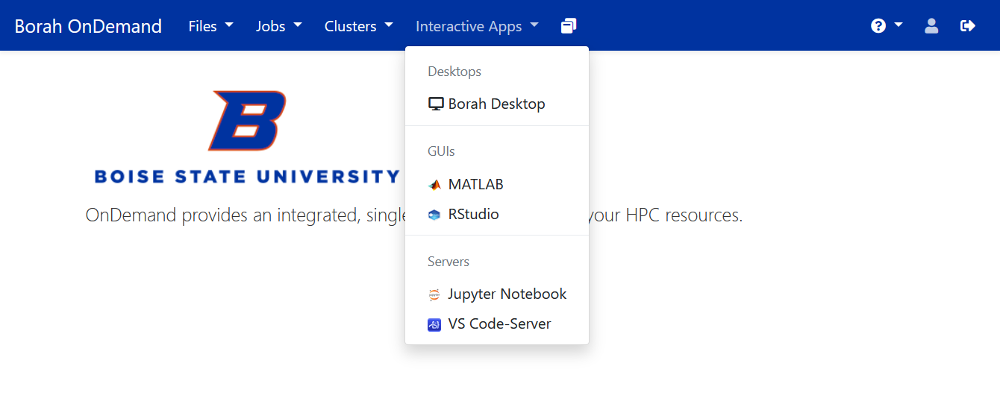
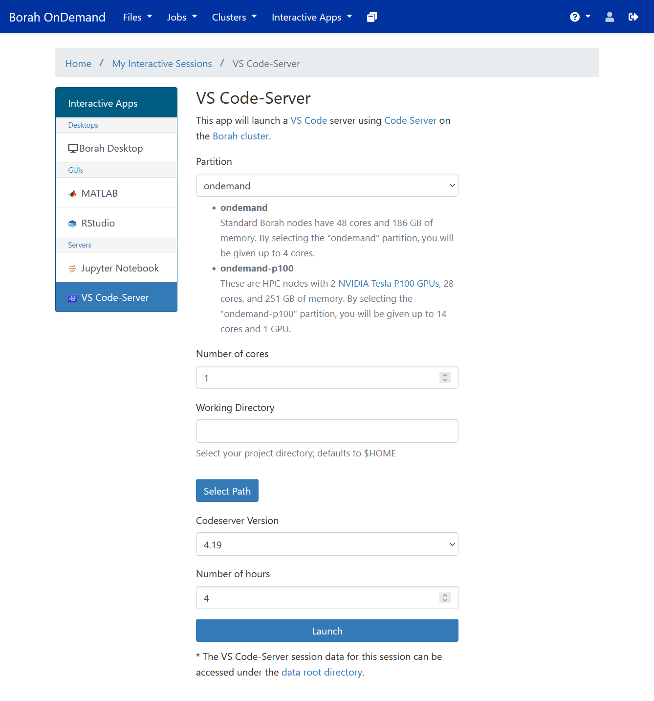

# Open OnDemand

Open OnDemand is a web portal that provides a graphical user interface (GUI) to a supercomputer cluster.
This open-source project is developed and maintained by the Ohio Supercomputer Center (OSC); you can learn more at  [https://openondemand.org/](https://openondemand.org/).

You can access the Open OnDemand portal for Borah at [https://borah-ondemand.boisestate.edu](https://borah-ondemand.boisestate.edu).
(You'll need to be on VPN and log in with your Borah username and password.)


## The Dashboard

When you first login you'll see the OnDemand Dashboard:

The services available can be accessed through the tabs at the top of the page.

## File Explorer


The file explorer tab provides a graphical explorer where you can upload, download, move, copy, delete, and create files and directories.
There is even a graphical text editor to modify files:


## Job Composer and Active Job Display


The Jobs tab gives access to the Active job display which will allow you to see all the current jobs submitted to the cluster--similar to the `squeue` command.

The Job Composer will let you create and submit a slurm job from a template.


## Shell Access

Through the "Clusters" tab you can access a terminal (shell) on Borah's login node:

This allows access to Borah without needing to download an ssh client or terminal emulator.

## Interactive Apps

Perhaps the most useful service on Borah OnDemand are the interactive apps, shown here:


!!! info "Note"

    You may see additional apps if you are an authorized user of proprietary licensed software.

After selecting and launching an interactive app, you will be taken to the "My Interactive Sessions" page.
This page will display cards for each current session with links to open the app in a new tab.
Cards for expired or failed sessions will also be shown.
You can also get to the "My Interactive Sessions" page by clicking the two pages icon to the right of the "Interactive Apps" tab on the top of the screen:

Please note there may be some wait time if all available resources are in use.
Once the job status (shown in the upper right of the session card) changes from "Starting" or "Queued" in blue to "Running" in green, you can click the "Launch" button at the bottom of the card to open the app in a new tab.

### Desktop


OnDemand provides a remote desktop on a compute node, which can be used to run interactive graphical applications.
Most applications will still need to be accessed through the module system, so you'll need to load the module and call the program through the terminal.
The terminal icon is shown here in the taskbar at the bottom of the desktop:


After opening the terminal application on the desktop, here is an example of the commands to open MATLAB:
```bash
module load matlab
matlab
```
And the resulting MATLAB GUI will open in a new window as shown here:


### Jupyter Notebook

Borah OnDemand also provides access to Jupyter Notebooks.
Jupyter notebooks can be used to run python, Julia, or R code alongside markdown text and images.
After launching the Jupyter Notebook interactive app and clicking "Connect to Jupyter" once your session is ready, you will be presented with a landing page in your home directory.
From here you can select an existing notebook to work in or you can use the "New" button to create a new notebook in an existing kernel:


For more information about how to create a custom Jupyter kernel from a conda environment, please read the [using a conda environment with Open OnDemand](software/conda.md#using-a-conda-environment-with-open-ondemand) section.
And to use Julia in a Jupyter notebook, please read [Adding the Julia Kernel to OnDemand](software/julia.md)

### VS Code-Server

When using an IDE on Borah, please use the VS Code Server Interactive App. 
!!! warning "Connecting using SSH from an IDE on your local computer could be shut down by the process killer."


After launching the VS Code session, it may take some time for a link to be generated. After clicking on the link to start the live session, you will be put in a new tab that is running the VS Code Server.
